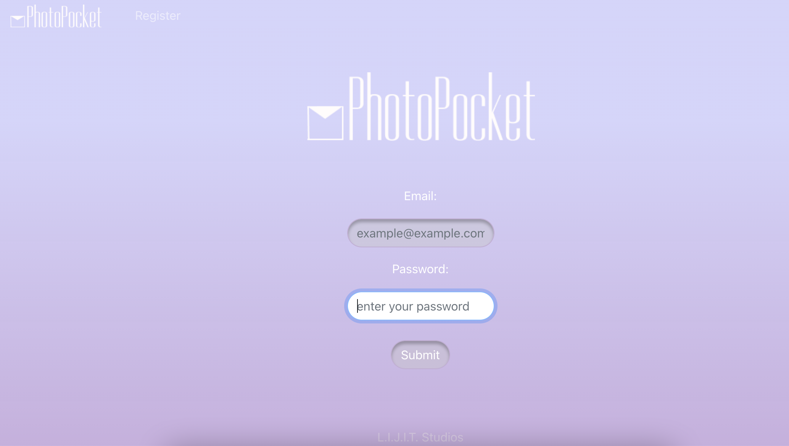
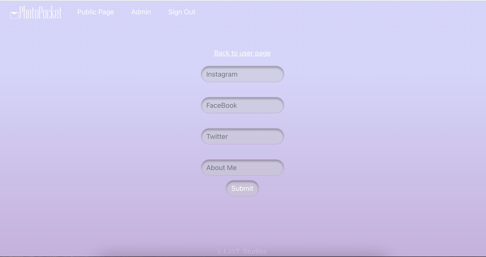
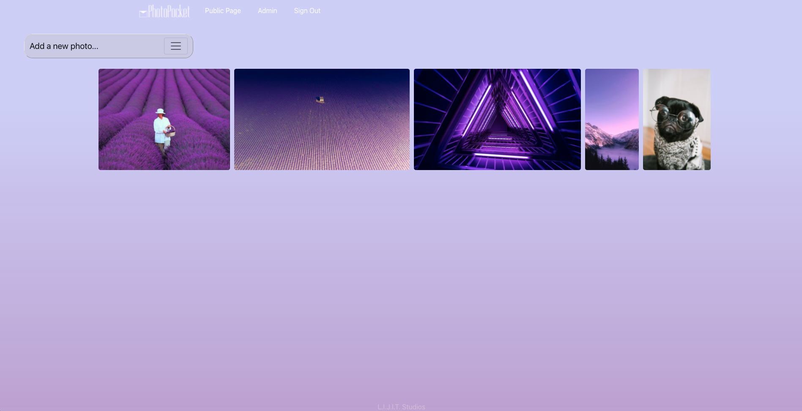

> # **_PhotoPocket_**

#### _By: Itallo Gama, Luke Foster & Janay Angiano_

#### 09/17/2021

| [Itallo's GitHub](https://github.com/ItalloGama) | [Itallo's LinkedIn](https://www.linkedin.com/in/itallo-gama/)|

| [Luke's GitHub](https://github.com/lfoster1150) |[Luke's LinkedIn](https://www.linkedin.com/in/luke-foster11/) |

| [Jae's GitHub](https://github.com/Jangui92) |[Jae's LinkedIn](https://www.linkedin.com/in/janay-anguiano-778717215/) |

> ## Getting Started

The project is deployed on Heroku and can be viewed [here](https://arcane-tor-98786.herokuapp.com/).
1. The first page allows you to login to an existing username or create a new one.
2. Once logged in you can start by adding your social medial links in the Admin page.
3. Navigating to one of your User page you can use the dropdown menu to add either image links or image files you would like to share.
4. Finally, by clicking one of these pictures, you can post a comment on the pictures you like!
5. For more behind the scenes information you can view our trello [here](https://trello.com/invite/b/RX6rCoOI/ce5e98ae3faf9aabff9f412205f0281d/photographyportfolio), and our product pitch [here](https://docs.google.com/presentation/d/1ollVIBW2RaQoHgyJ9ipOZQrmWLrSA5U2S3im5Pm9uIg/edit#slide=id.p).
> ## _Technologies used_

- Postres
- Express
- React
- Node
- Heroku
- AWS S3

> # _Details_
>
> **_PhotoPocket_** is a site designed for photographers to display their photographs on their portfolio for potential clients or inspiration for other photographers. Users can share detailed information about their photos while also leaving comments on photos from other users.

### Client Details

Users will be able to register, login and navigate from their user profile. Users will be able to post comments under the photos posted in their profile to give more details to viewers.

> ## _Screenshots_
>
> 

> ## _Credits_

- [Bootstrap](https://getbootstrap.com/)
- [Stack Overflow](https://stackoverflow.com/)
- [Figma](https://www.figma.com/file/J9hSvvWe8ERhaKt44vYk4D/Untitled?node-id=0%3A1)
- [Amazon S3](https://aws.amazon.com/pm/serv-s3)
- [Social Media Links](https://icons8.com/icons/set/social-media)

> ## _Future Updates_

- [x] Integrate Cloudinary or AWS S3 to allow the user to upload their own image files
- [ ] Add a new table that gives the user the ability to follow other users
- [ ] Alternate color themes to give the user more creative control
